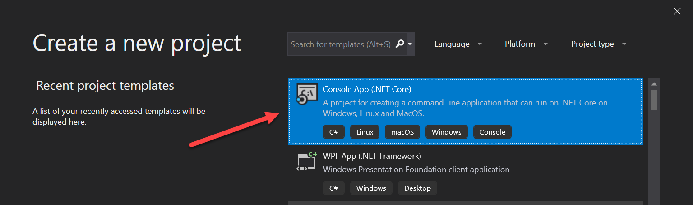

Camel in C#
===========

If you had me for CMSC 150, you likely remember the Camel game. Your task for
this assignment is to code the Camel game in C#.

Here is the link for the description of the Camel game:

https://arcade-book.readthedocs.io/en/latest/labs/lab_04_camel/camel.html

Use Visual Studio. It is free to install. You can download it from here:
https://visualstudio.microsoft.com/downloads/

Create a new console app project, and call it ``Camel``:

This open with a "Hello World" program. Run the program. It will appear
in a separate console window as opposed to a window in the IDE.

Here's some code to get started:

.. code-block:: c#
   :linenos:

    using System;

    namespace Camel
    {
        class Program
        {
            static void Main(string[] args)
            {
                // Introductory message
                Console.WriteLine("Welcome to Camel!");

                // Main game loop
                bool done = false;
                while (!done)
                {
                    // Print commands
                    Console.WriteLine();
                    Console.WriteLine("A. Drink from your canteen.");
                    Console.WriteLine("B. Ahead moderate speed.");
                    Console.WriteLine("C. Ahead full speed.");
                    Console.WriteLine("D. Stop and rest.");
                    Console.WriteLine("E. Status check.");
                    Console.WriteLine("Q. Quit.");

                    // Get user command
                    Console.Write("What is your command? ");
                    string userCommand = Console.ReadLine();
                    Console.WriteLine();

                    // Process user command
                    if (userCommand == "a")
                    {
                        Console.WriteLine("You drank from the canteen.");
                    } else
                    {
                        Console.WriteLine("Unknown command.");
                    }
                }
            }
        }
    }

Part of this task is practicing how to quickly search up answers. I'm not
going to step through how to code in C#, you have enough talent to get started
on your own.

We will review some of programs together so we can get ideas from each other.

Today, make sure you have created a project that can print "Hello World." By the
time you come to class Thursday, have a start to the main game loop.

While it is possible to code the program in one function and loop, see if you
can use good design and break the parts into functions.

Feel free to change the theme and add features.

If you change the theme, you must still have a number line you are traveling
across, some kind of resource you can run out of, and "something" that can catch
you.

Be ready to present your work on Thursday and your final project on Tuesday.

To turn in, upload GitHub URL to your project.