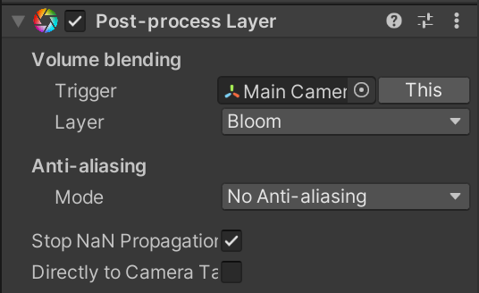

Adding a Bloom Effect
=====================

.. contents::

Step 1 - Add the post processing package to your project
--------------------------------------------------------

Go to Window -> Package Manager and then install the "Post Processing"
package. This is project-wide so this only needs to happen once for an
entire project.

Step 2 - Enable HDR for the project
-----------------------------------

Step 3 - Add a post-processing layer to the camera
--------------------------------------------------

Select the camera. Add a post process layer component to the camera.

Select the 'Bloom' layer. You may need to create this layer if it does
not yet exist for your project.

Step 4 - Create a post processing profile
-----------------------------------------

Find/create a directory for post processors.

Create a post processor:

Add a bloom effect:

.. image:: bloom.png
   :width: 50%

Step 5 - Create a post processing volume
----------------------------------------

Go to your project, add an empty. Call it "post-process bloom" or something
like that.

Add a "Process Volume" component to it.

Drag in the post processor to the proper field.

This makes everything glow, fine if you are doing some neon geometry wars
thing. But what about just one thing?

Step 6 - Make one thing glow
----------------------------

Set post-processing intensity to 1. Zero turns it off, we don't want that.
Above 1 will make everything glow. Don't want that.

Create a new material called "Glow".

Give it the following properties:

You have to specify the color, it doesn't pick it up from the image.

