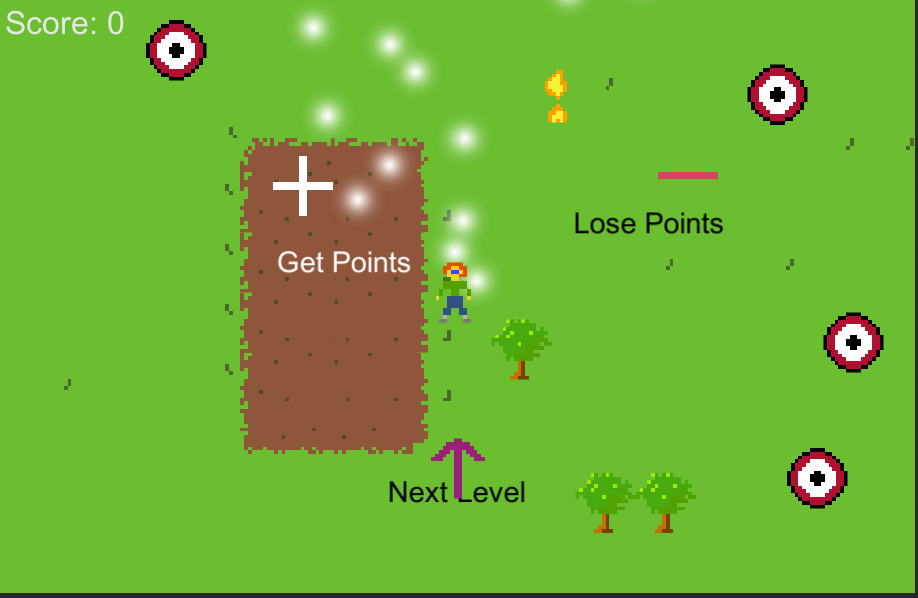
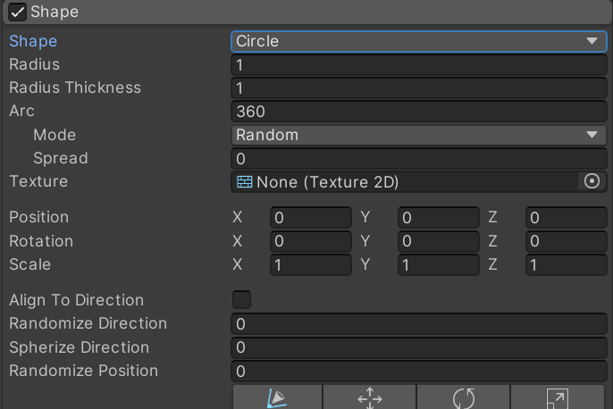
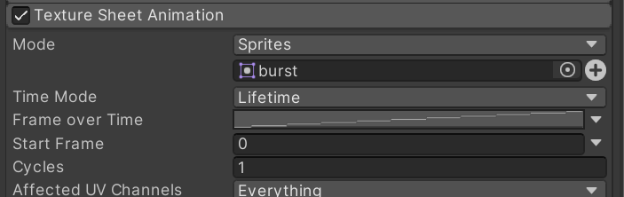
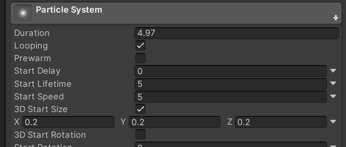

2D Particle System
==================

.. contents::

Let's make particles! For a YouTube video that covers this, see:
https://www.youtube.com/watch?v=_z68_OoC_0o

Create a white sprite particle
------------------------------

Use Aseprite

Add a particle system
---------------------

In Unity, select GameObject -> Effects -> Particle System.
You should now have a new particle system in your game throwing off fuzzy dots.

The rotation of the default system has the particles flying up.
Take out the -90 rotation on the particle game object and the particles fly towards the camera.
Experiment with it.

Experiment with shape of emitter.

Add gravity to make the particles fly down.

Make the particles sprites
--------------------------

Scale the particles
~~~~~~~~~~~~~~~~~~~

Color the particles
~~~~~~~~~~~~~~~~~~~

.. image:: color.png

Amount of particles
~~~~~~~~~~~~~~~~~~~

Adjust "rate over time"

Make it better
--------------

If you like coding, figure out how to make a 'burst' appear when destroying an object.

Try adding trails, as shown in the video.