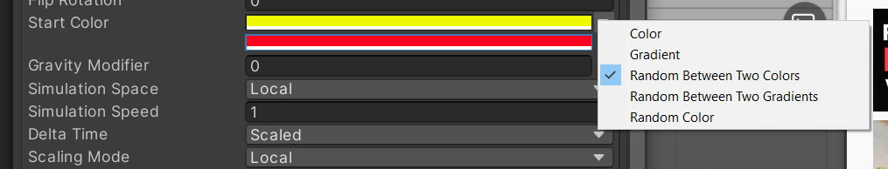

2D Particle System
==================

.. contents::

Let's make particles! For a YouTube video that covers this, see:
https://www.youtube.com/watch?v=_z68_OoC_0o

Create a white sprite particle
------------------------------

Use Aseprite

Add a particle system
---------------------

In Unity, select GameObject -> Effects -> Particle System.
You should now have a new particle system in your game throwing off fuzzy dots.

The rotation of the default system has the particles flying up.
Take out the -90 rotation on the particle game object and the particles fly towards the camera.
Experiment with it.

Experiment with shape of emitter.

.. image:: shape.png

Add gravity to make the particles fly down.

Make the particles sprites
--------------------------

Scale the particles
~~~~~~~~~~~~~~~~~~~

.. image:: particle_size.png

Color the particles
~~~~~~~~~~~~~~~~~~~

Amount of particles
~~~~~~~~~~~~~~~~~~~

Adjust "rate over time"

Particle trails
~~~~~~~~~~~~~~~

Try adding trails, as shown in the video.

Make things blow up when hit
----------------------------

Update your code so that your bullet script will create a "burst" prefab when you
hit an item. You'll need to have the prefab be created with a script that will destroy
itself over time.

.. note::

   This example just shows the important parts. It doesn't show the needed "make the bullet
   disappear after a while." We showed that earlier. You'll need to combine your scripts.

.. code-block:: c#

    using System.Collections;
    using System.Collections.Generic;
    using UnityEngine;

    public class BurstBulletScript : MonoBehaviour
    {
        public GameObject burstPrefab;
        Rigidbody2D body;

        // Start is called before the first frame update
        void Start()
        {
            body = GetComponent<Rigidbody2D>();
        }

        public void OnTriggerEnter2D(Collider2D collision)
        {
            if (collision.tag == "Destroyable")
            {
                // Destroy the item
                Destroy(collision.gameObject);
                // Create the 'burst' effect
                var burst = Instantiate(burstPrefab, body.position, Quaternion.identity);
            }
        }
    }

