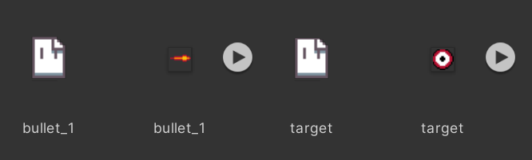
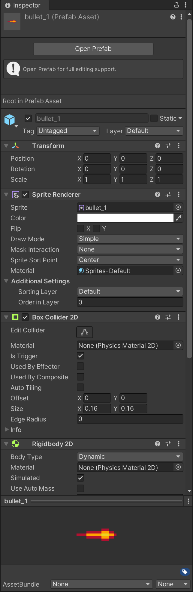
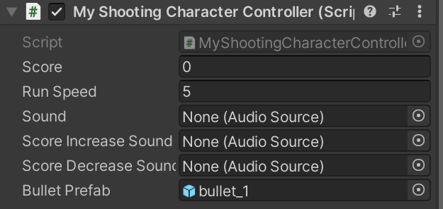
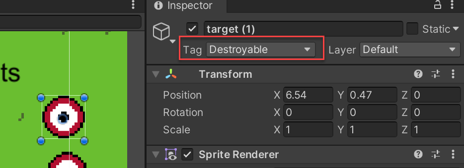

.. _2d_shooting:

2D Shooting
===========

.. contents::

There are three main ways to shoot things in Unity.

* For laser-types of things where you insta-hit, you can use **ray-casting**.
* You can move sprites and check by distance.
* You can move sprites, and use colliders. This is how we are going to demo things here.

Make a sprites in Aseprite
--------------------------

We need a target and a projectile.

* Make a bullet, laser, heart, whatever projectile you want to shoot.
* Make a target to hit.
* Export, and import into Unity changing the normal three things. (pixels per unit, compression, filter)

Detect mouse down events
------------------------

Now, we will use the mouse button to shoot. First, we need to detect mouse-down events.

In our ``Update`` method on cour controller (not ``FixedUpdate``, doesn't seem to work well), we can detect a mouse-down
event with ``Input.GetMouseButtonDown(0)``. The 0 is for our left mouse button. An implementation might look like:

.. code-block:: c#

    // Has the mouse been pressed?
    if (Input.GetMouseButtonDown(0))
    {
        Debug.Log("Mouse down");
    }

Code and confirm it works.

Create a bullet
---------------

Now we need something to shoot.

* Create a bullet prefab.
* Add a box collider so we can detect collisions. Set the collider to be a trigger, as we don't want it bumping
  into things.
* Add a rigidbody so we can move it via physics.

Go to your character controller cand add a public variable for the prefab. Code would look like:

.. code-block:: c#

    public GameObject bulletPrefab;

Then drag the prefab into the new blank spot in your character.

Update code to fire the bullet:

.. code-block:: c#

    // Mouse pressed?
    if (Input.GetMouseButtonDown(0))
    {
        // Make a bullet
        var bullet = Instantiate(bulletPrefab, body.position, Quaternion.identity);
        // Get the body of the bullet
        var bulletbody = bullet.GetComponent<Rigidbody2D>();
        // Move the bullet to the right
        bulletbody.velocity = new Vector2(4, 0);
    }

It would be better code if you make the speed a public variable rather than hard-code it.
And we'll get to aiming in a bit.

Create targets
--------------

Now we need something to shoot.
Create targets. Add a collider. Add a tag for "Destroyable".

Add a bullet script to destroy
------------------------------

This bullet script will destroy itself after moving 8 units, or it will destroy an object
tagged 'destroyable'.

.. code-block:: c#

    using System.Collections;
    using System.Collections.Generic;
    using UnityEngine;

    public class BulletScript : MonoBehaviour
    {
        Vector3 _origin;
        public float maxDistance = 8.0f;

        // Start is called before the first frame update
        void Start()
        {
            // Get position we started at, so we can see how far the bullet traveled.
            _origin = transform.position;
        }

        public void OnTriggerEnter2D(Collider2D collision)
        {
            Debug.Log("Trigger");
            if (collision.tag == "Destroyable")
            {

                Debug.Log("Destroyable");
                // Destroy item we hit
                Destroy(collision.gameObject);
                // Cause bullet to destroy itself
                // Put this outside the if to get deleted when hitting non-destroyable objects
                Destroy(gameObject);
            }
        }

        // Update is called once per frame
        void Update()
        {
            // How far has the bullet gone?
            float distance = Vector2.Distance(_origin, transform.position);
            // If too far, then remove ourselves from the game.
            if (distance > maxDistance)
            {
                // Cause bullet to destroy itself
                Destroy(gameObject);
            }
        }
    }

Calculate angles
----------------

Next, if we want to fire in a particular direction, we need to do some math. Here's the code with comments.

.. code-block:: c#
   :linenos:

    // Get the angle of a vector
    public float GetYRotFromVec(Vector2 v1)
    {
        float _r = Mathf.Atan2(v1.y, v1.x);
        float _d = (_r / Mathf.PI) * 180;

        return _d;
    }

    void Update()
    {
        // Get our axis values
        horizontal = Input.GetAxisRaw("Horizontal");
        vertical = Input.GetAxisRaw("Vertical");

        // Has the mouse been pressed?
        if (Input.GetMouseButtonDown(0))
        {
            // -- Fire a bullet

            // Create the bullet
            var bullet = Instantiate(bulletPrefab, body.position, Quaternion.identity);
            // Get a reference to the bullet's rigid body
            var bulletbody = bullet.GetComponent<Rigidbody2D>();
            // Where is the mouse on the screen?
            var mousePosition = Input.mousePosition;
            // Where is the mouse in the world?
            Vector3 target3 = Camera.main.ScreenToWorldPoint(mousePosition);
            // Set the z value of this vector 3
            target3.z = 0;
            // What is the normalized vector from the player to the mouse?
            Vector2 direction = (target3 - transform.position).normalized;
            // What is the angle in degrees?
            float angle = GetYRotFromVec(direction);
            // Rotate the bullet
            bulletbody.rotation = angle;
            // Give the bullet speed
            bulletbody.velocity = direction * bulletSpeed;
        }
    }