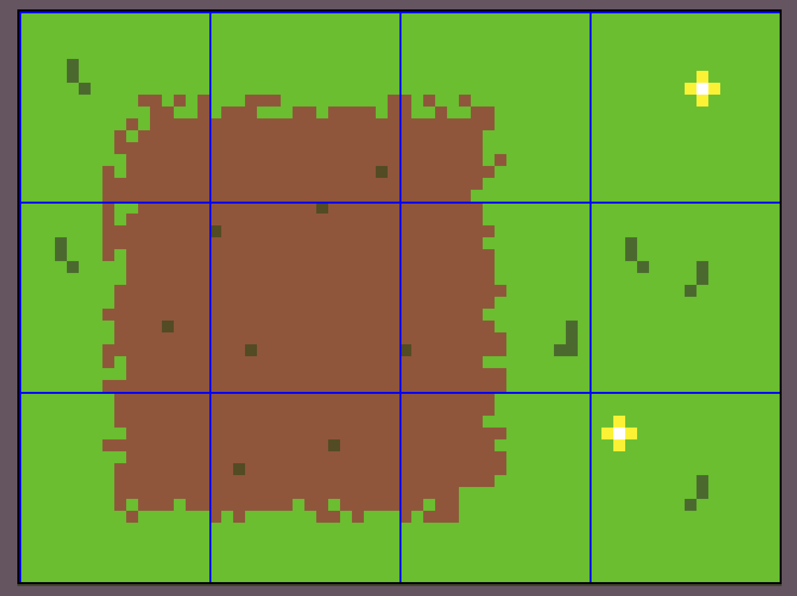
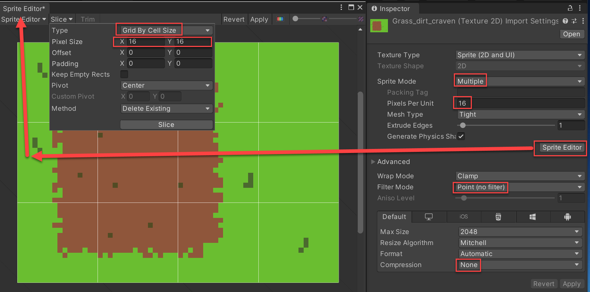
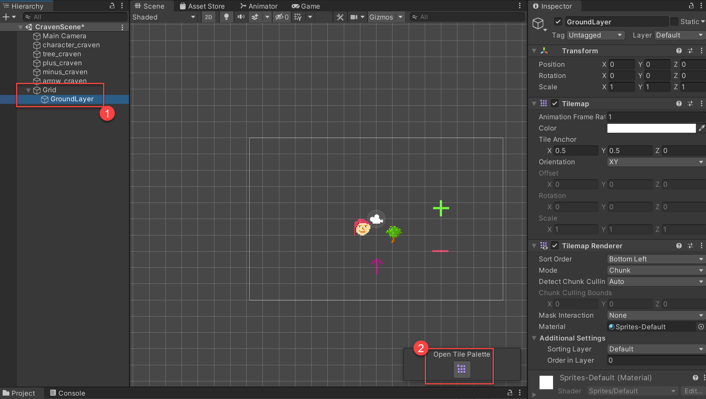
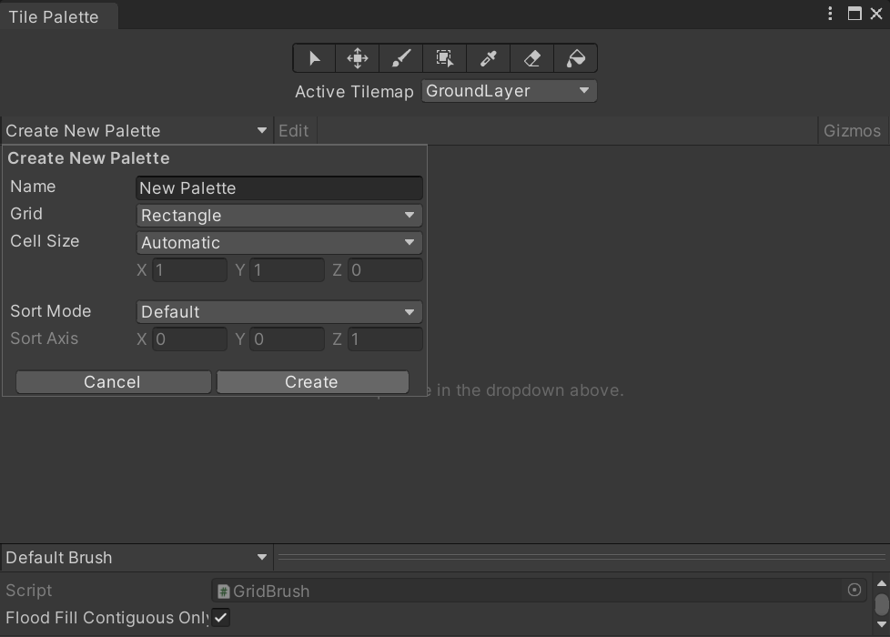
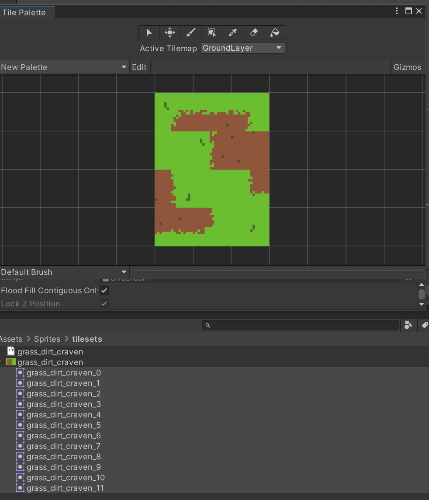
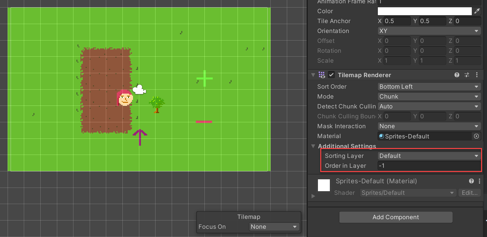

.. _unity2d_part_2:

2D Unity Part 2
===============

.. contents::
    :depth: 3

Create tile set
---------------

Tiles will be 16x16. We'll make multiple tiles at a time. Make a 16*3 and 16*4
image:

Keep in mind in Aseprite you can:

* Use things like 16*3 in the sprite dimensions, no need to multiply itself.
* You can show the grid overlay

Import and split tile set
-------------------------

When you import the sprite, we need to set our standard three changes, and then
set it to multiple sprites. Then we click on the nearly-hidden sprite editor
button and slice it up.

* Commit and push.

Create tile map and palette
---------------------------

* Create a new rectangular tile map for your scene.
* Open the tile palette.
* Create your own tile palette with your own name

Create a new palette. Create a new folder for it "Tile Palette".

Select your sprites. Move to palette. Create folder for "Tile images".

Order is weird. Somehow there's a way to import better I think, but I don't know it.
To change order, click 'Edit' button and then alternate between S and M keys to move
tiles to where you'd like.

* Paint with the tiles.
* Change your rendering order so tiles appear below your sprites. Use layers,
  or ordering in layers.

* Show how to do layers
* Show how to do a tile collider 2d