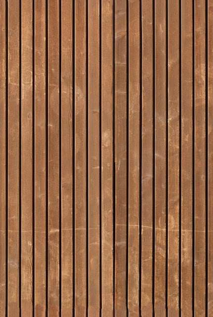
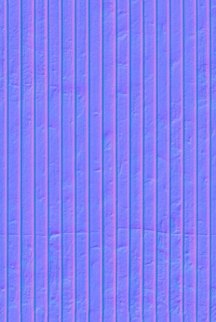
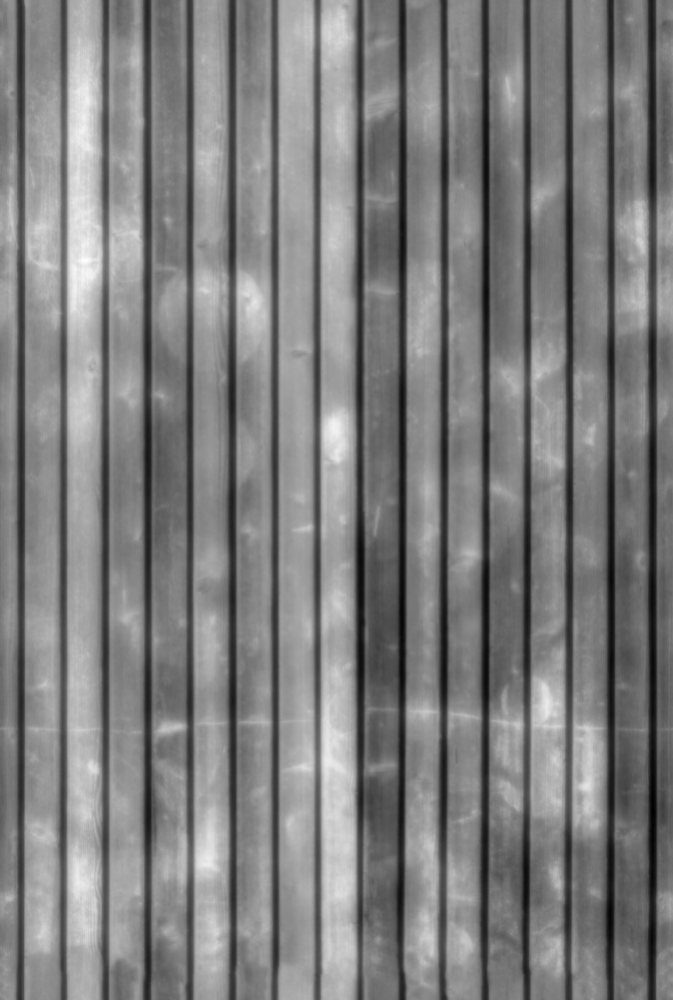
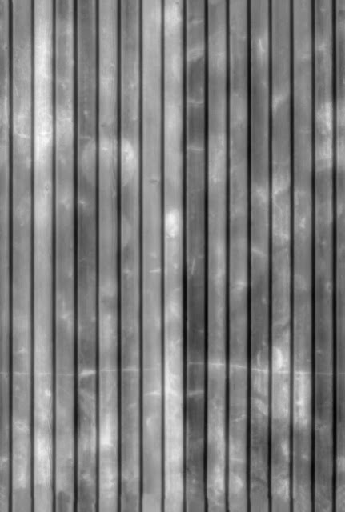
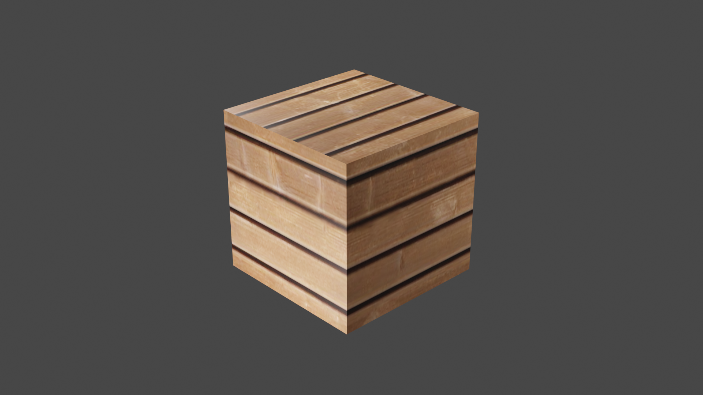
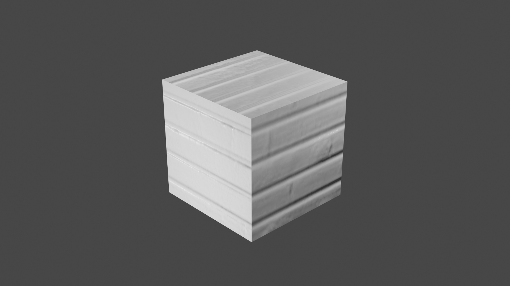
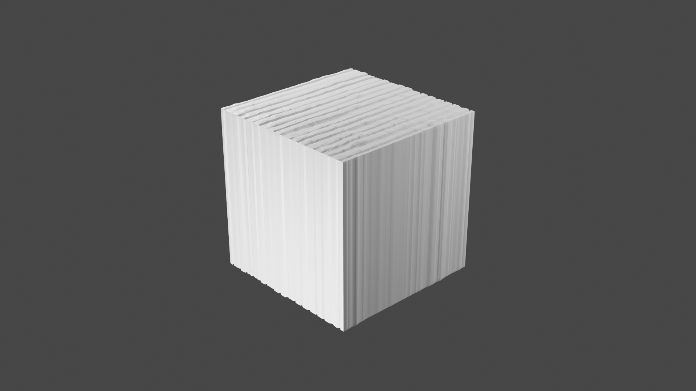
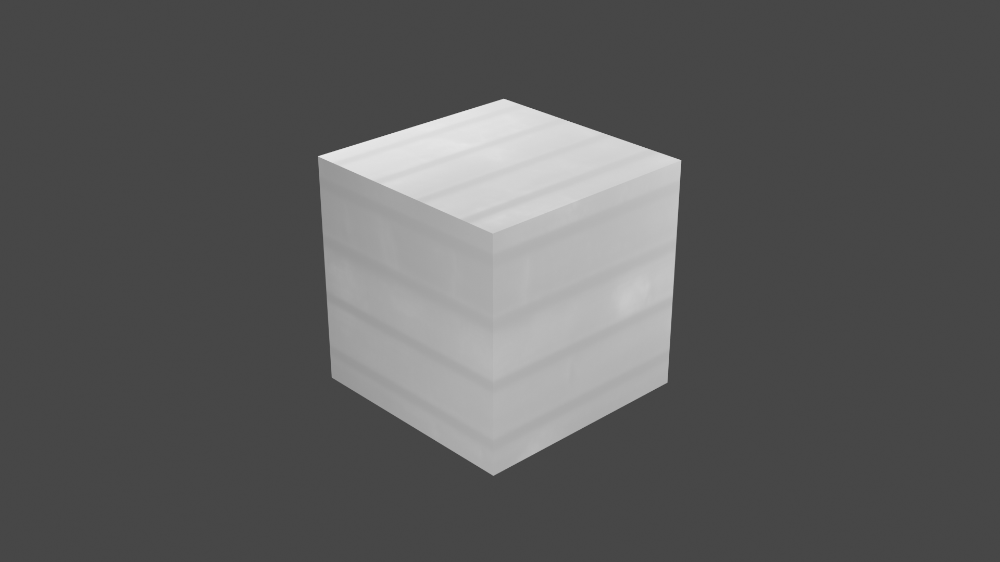
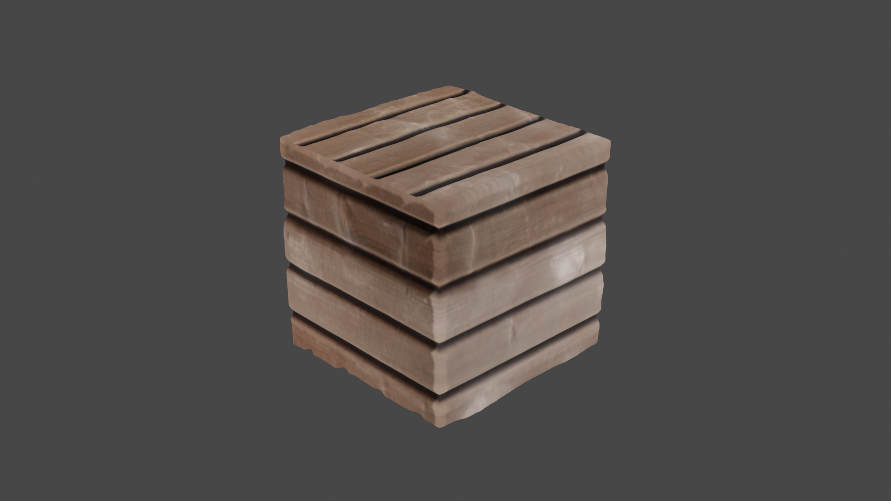
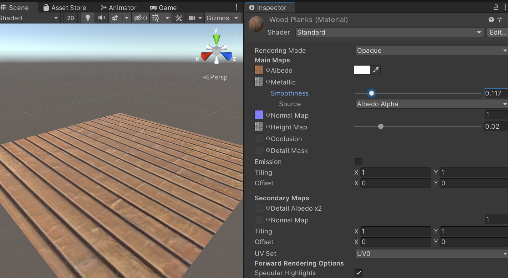

Texture Objects
===============

We want to put an image on an object, rather than just have a solid color.

Texture Types
-------------

There are several types of textures.

* Diffuse/Albedo map - Color for object. The is the basics of what you need.
  Although the image can look "flat." Think bricks. Shouldn't look flat, but will
  be with just a diffuse map.
* Bump maps - Create illusion of depth via grayscale data. Shade of gray is height.
  These are grayscale images.
* Normal maps - Better than bump maps, uses RGB for more info. This can give us
  x, y, and z. Allows for angle and more realistic looks. These maps tend
  to look blue.
* Displacement/Height map - This map is used to actually changes surface they are on.
* Specular/Metallic - Maps out what part of the image is shiny.

Here are some samples from `Texturise <http://www.texturise.club/>`_, their
"`Tilable Wood Planks Texture <http://www.texturise.club/2013/08/tileable-wood-planks-maps.html>`_".

   Texture

   Normal

   Specular

   Displacement

   Albido/Texture image/Color

   Normal

   Displacement

   Specular

   Everything

Here they are, in action on Blender.

Texture Websites
----------------

Where can you get textures?

* `Texturise <http://www.texturise.club/>`_
* `Poly Haven <https://polyhaven.com/textures>`_
* `Poliigon <https://www.poliigon.com/textures>`_ (Paid)

Very Simple Textures
--------------------

* Create a new project.
* Add a 10x10 plane.
* Create a folder called "Textures"
* Toss the images there.
* Create a material in that folder.
* Toss onto the plane.
* Put images into texture

  * Toss 'texture' to Albedo.
  * Toss 'specular' to 'metalic'. Change to 'Albedo Alpha' and turn smoothness
    down to about 0.1.
  * Toss 'normal' to 'normal map'
  * Toss 'displacement' to 'Height map'

* You can change the 'tiling' to control how many times it repeats on the surface.
