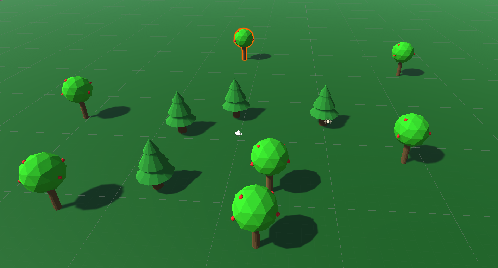

Blender to Unity
================

Our goal is to learn to create simple, low-poly 3D items in Blender. Color them. Then import to Unity.

.. note::

  Don't forget to Blender scale interface up before showing this tutorial so people can see.

Set Up Unity
------------

* Create a new 3D project in Unity
* Create a 20x20 dark green plain for the ground

Create 3D Items in Blender
--------------------------

* Open Blender
* Notice window and hierarchy, like Unity
* Navigation

  * Click-left to select
  * Middle click to rotate around focused object (Unity is alt-left click)
  * Number pad . to change focus (Unity is F key)
  * Shift-Middle button pans (unity is just left click if you are in the 'hand tool' mode)
  * Show axis thing in upper right to select side views. Also show num pad

* Delete everything. We don't want to import a camera or light.
* We will be creating one file for each object.

  * Select item in hierarchy or screen, then delete key

* Add->Mesh->Cylinder

  * Lower left, expand out window and select 0.5 meters and 12 verts

* Edit object

  * Explain object mode, and edit mode. Use tab to switch
  * Show vert, edge, face select tools
  * Show alt-click to get circle
  * Show 'E' to extend.
  * Show 'S' to scale.
  * Show 'G' to move.
  * Show xyz to select axis
  * Make pine tree. Show how to scale to zero.

  .. image:: pine_in_blender.png
     :width: 40%

Materials in Blender
--------------------

* Materials

  * Show how to create a material for leaves
  * Assign it.
  * Can't see it! Show select material view. And other views.
  * Create new material for trunk
  * Now need to assign. Show wireframe, face select, hidden faces.

Import in Unity
---------------

* Back to unity

  * Create folder for blender models
  * Open in explorer. Copy path

* Back to blender, save to path

  * pine tree

* Unity & blender native files

  * Export to FBX

* Back to Unity.

  * Drag file into scene

  .. image:: pine_in_unity.png
     :width: 60%

More Practice
-------------

* Repeat, but create a tree using an icosphere. Add apples.

  * Show Ctrl-L for selecting linked
  * Shift-D to duplicate
  * Brand new blender file, do not combine
  * Watch scale

  .. image:: apple_tree.png
     :width: 40%

Weekend Assignment
------------------

* Out of class, work through Chapter 1 and Chapter 2.
  You can skip the last object modifiers item in Chapter 2.

  * https://cgcookie.com/course/basics-intro-to-blender-3-0

