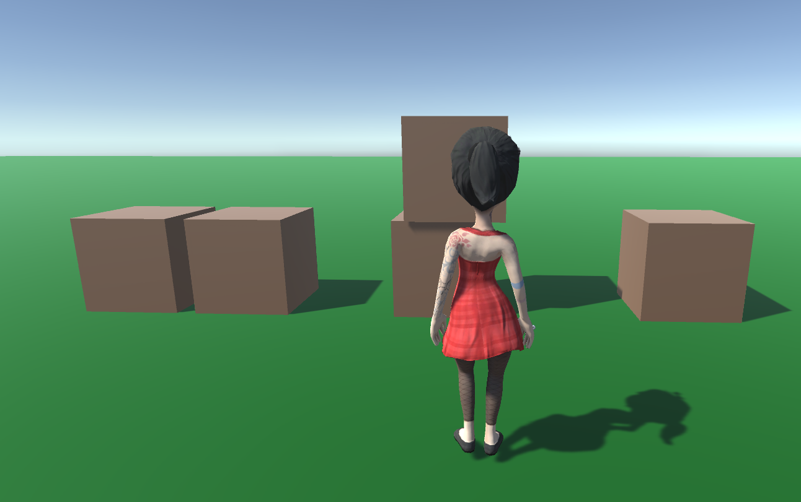
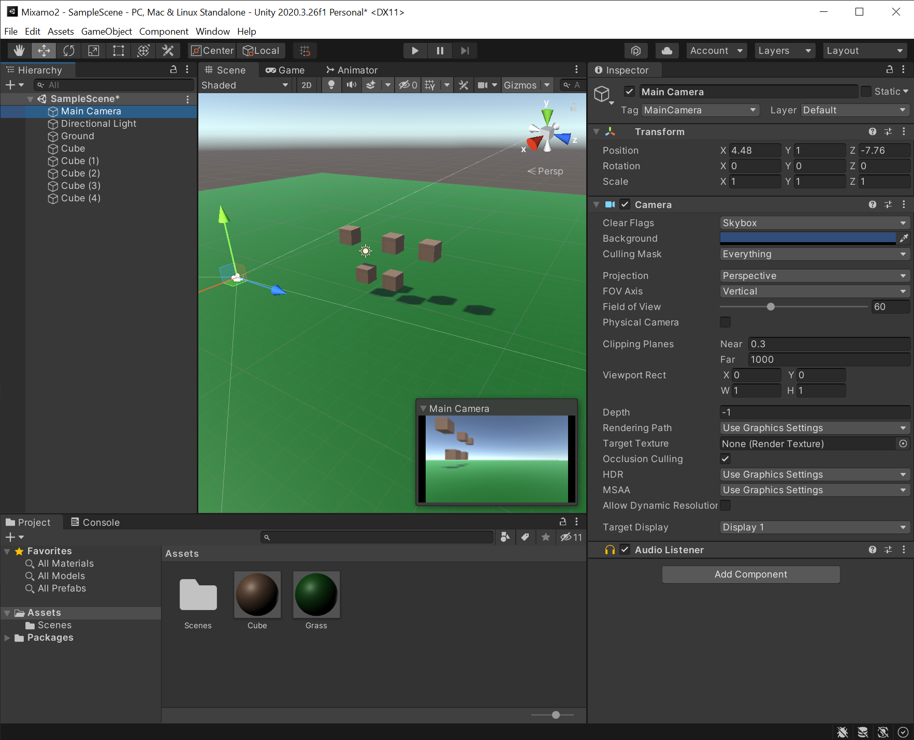
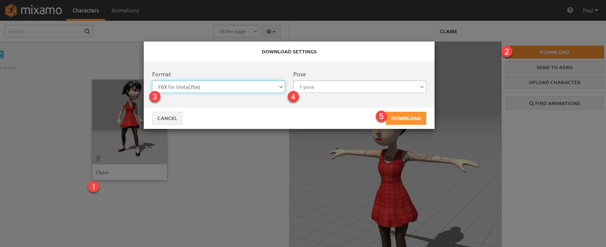
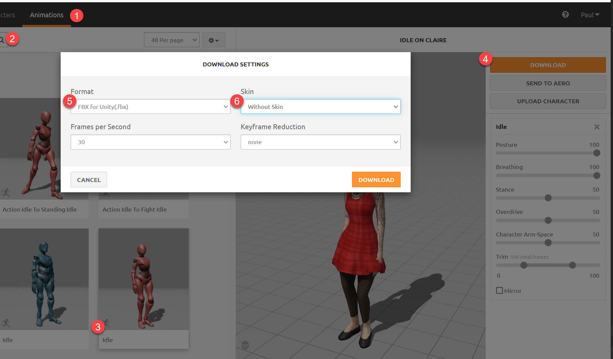
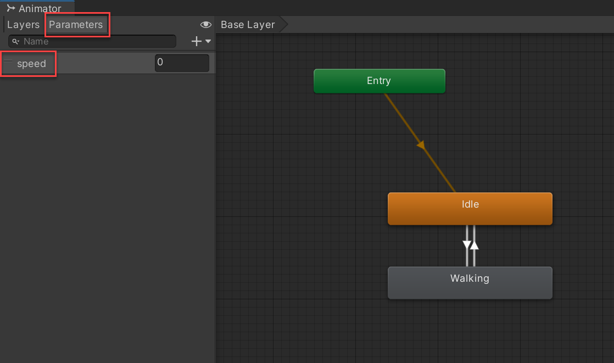
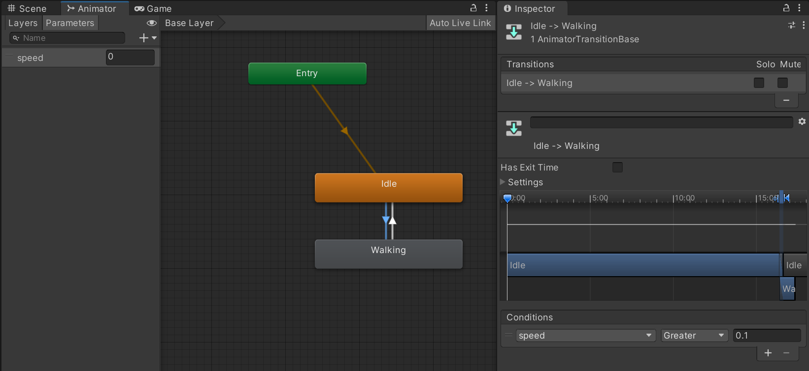
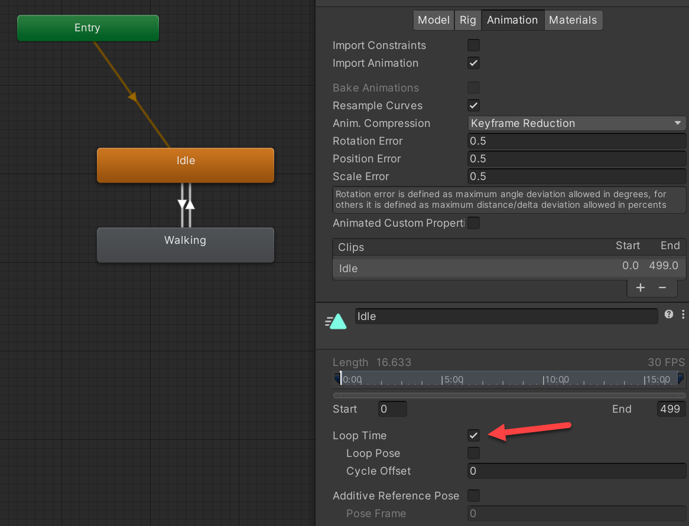

Mixamo to Unity
===============

This covers how to get a 3D character into your scene, using `Mixamo <https://www.mixamo.com/>`_ character assets and animations.

Mixamo has a few character assets (not its primary purpose) and a lot of animations for characters (its primary
purpose).

Setup
-----

Our goal here is to create a landscape for our character to walk around. We'll add a plane and have a few cubes
to help with a sense of distance and perspective.

#. Create a new Unity 3D project
#. Add a plane, name it "Ground"
#. Scale x/z to 10x10
#. Create a grass material color
#. Add material to plane
#. Create a cube
#. Create a different material and add to cube
#. Add rigid body physics to cube. Test.
#. Duplicate a few cubes
#. Position the camera
#. Don't forget to save

Download the Character from Mixamo
----------------------------------

#. Go to `Mixamo.com <https://www.mixamo.com/>`_
#. Log in. You'll log in with an Adobe id or some SSO choice they have.

Get the Character
^^^^^^^^^^^^^^^^^

Once there, go to the "Character" tab and find a character you like. I'm using Claire.

#. Select your character
#. Hit "Download"
#. You want "FBX for Unity". You do **not** want the generic FBX it defaults to.
#. Make sure T-Pose is selected
#. Download

Get the Animations
^^^^^^^^^^^^^^^^^^

Now we need our idle and walking animations.

#. Switch to "Animations"
#. Search on "Idle"
#. Select an idle animation. If you don't see it play with your character hit "refresh" on the browser.
   You can adjust the animation. For example, widen out the hands so they don't clip through the characer.
#. Click "Download"
#. Select FBX for Unity. (Again, the default FBX doesn't work.)
#. Select "Without Skin" because we already downloaded that.

Next, repeat for a walking animation.

Add Mixamo Characters and Animations to Project
-----------------------------------------------

Now we want to get the character to appear in our project.

#. Create a folder for your character. In this case, I used "Claire".
#. Create subfolders for "Materials" and "Textures"

   .. image:: claire_folder.png
      :width: 50%

#. Drag the character and two animations from your 'downloads' to the folder you created.
#. Drag the character from the assets to your scene. It will be white, as no textures ore materials have been applied yet.

   .. image:: white_character.png
      :width: 50%

#. Next click on your character in Assets.
#. Select Materials in the Inspector panel.
#. Click "Extract Textures" and put them in the Textures folder we created.
#. Click "Extract Materials" and put them in the Materials folder we created.

   .. image:: extract_materials.png
      :width: 70%

#. If you get a message like this, just go ahead and fix.

   .. image:: fix.png
      :width: 50%

#. Now your character should look good.

   .. image:: t-pose.png
      :width: 50%

Get Character to Move
---------------------

Now we need to get the character to move around.
We are going to use a **character controller**. It is more complex than rigid body physics, but offers more control.

Add Character Controller
^^^^^^^^^^^^^^^^^^^^^^^^

#. Select your character.
#. Select "Add Component" in the inspector.
#. Add a character controller.
#. The character controller has a 'capsule' for hitbox calculations. Adjust the size and positioning of this so it
   goes around your character.

   .. image:: character_controller.png
      :width: 50%

Add Character Script
^^^^^^^^^^^^^^^^^^^^

* Make the camera a 'child' of the player and position behind the player.
* Add this character script:

.. literalinclude:: CharacterScript.cs
   :language: c#
   :linenos:

* While the character does not animate yet, it should be able to move with mouse and WASD keys.

Animate
-------

Add Idle Animation
^^^^^^^^^^^^^^^^^^

#. Click on your character folder in assets, and add an **Animator Controller**.

   .. image:: add_animator_controller.png
      :width: 70%

#. Double click on the animator controller to edit it. Then drag the *idle* animation to the controller.
#. Drag the animator controller to your player object. Run. The player should now display the idle animation.

Add Speed Parameter
^^^^^^^^^^^^^^^^^^^

We will need to transition from idle to walking based on speed. We need to update our character controller to
spit this out. Here's our updates:

.. literalinclude:: CharacterScript2.cs
   :language: c#
   :linenos:
   :emphasize-lines: 13, 19, 31, 44-45, 73

Now in the Animator, we should be able to add ``speed``:

Then we can add in our "walk" animation. Add transitions, and make it based on speed. Greater than 0.1, we animate.
Less than 0.1, we idle.

It will only run the animation once, so on both we have to select it to loop.

References
----------

* Acacia Developer.  `First Person Controller <https://www.youtube.com/watch?v=PmIPqGqp8UY>`_. Sep 10, 2020
* Acacia Developer. `Unity FPS Controller code <https://github.com/Acacia-Developer/Unity-FPS-Controller/blob/master/Assets/Script/PlayerController.cs>`_. Sep 10, 2020
* Niklas Bergstrand. `Adding walk and run animation in Unity <https://bergstrand-niklas.medium.com/adding-walk-and-run-animation-in-unity-408f87d37ef2>`_. May 19, 2021